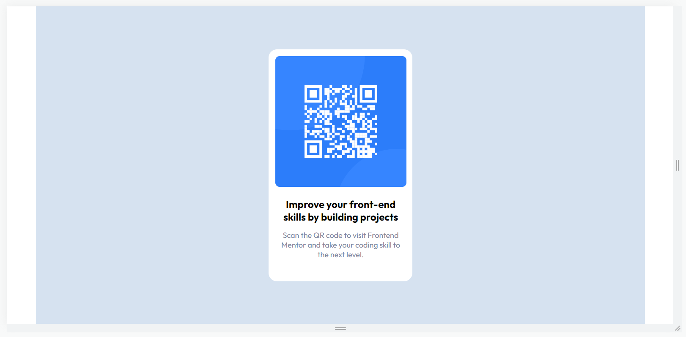

# Frontend Mentor - QR code component solution

This is a solution to the [QR code component challenge on Frontend Mentor](https://www.frontendmentor.io/challenges/qr-code-component-iux_sIO_H). Frontend Mentor challenges help you improve your coding skills by building realistic projects. 

## Table of contents

- [Overview](#overview)
  - [Screenshot](#screenshot)
- [My process](#my-process)
  - [Built with](#built-with)
  - [What I learned](#what-i-learned)
  - [Continued development](#continued-development)
  - [Useful resources](#useful-resources)
- [Author](#author)

## Overview

### Screenshot



This is my version of the QR code component, i tried to do the same.

## My process

### Built with

- Semantic HTML5 markup
- CSS custom properties
- Flexbox
- CSS Grid
- Mobile-first workflow

### What I learned

I want to share what i learned with this challenge, first in my html i tried to use BEM's methodology and I think it's ok, and then I learned a little about flex and grid. 

```html
<section class="container">
    <div class="card">
      
      <h1 class="card__title">Improve your front-end skills by building
        projects</h1>
      <p class="card__subtitle">Scan the QR code to visit Frontend Mentor
        and take your coding skill to the next level.
      </p>
    </div>
  </section>
```
```css
.container{
      margin: auto;
      max-width: 1440px;
      background: hsl(212, 45%, 89%);
      display: flex;
      justify-content: center;
      align-items: center;
      height: 100vh;
    }

.card{
      width: 340px;
      height: 550px;
      background: hsl(0, 0%, 100%);
      border-radius: 20px;
      display: grid;
      grid-template-rows: 64% 14% 18%;
    }
```

### Continued development

I learned something about flexbox and grid, but I think that I need more practice and see some differents ways to use them in order to improve my skills.

### Useful resources

- [Example resource 1](https://platzi.com/blog/bem/) - This helped me to understand better BEM's methodology. I really liked this pattern and will use it going forward.
- [Example resource 2](https://cssbattle.dev/) - This is an amazing web page, that could help anyone to improves your CSS skills.

## Author

- Website - [Freddy Santana](https://github.com/Creixz)
- Frontend Mentor - [Creixz](https://www.frontendmentor.io/profile/Creixz)
- Twitter - [@MrSantana92](https://twitter.com/MrSantana92)
